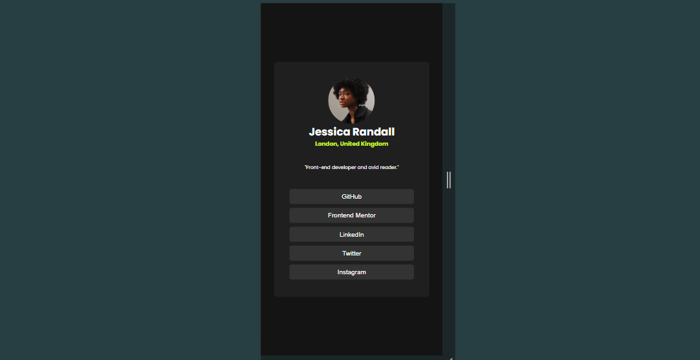

## Table of contents

- [Overview](#overview)
  - [Screenshot](#screenshot)
  - [Links](#links)
- [My process](#my-process)
  - [Built with](#built-with)
  - [What I learned](#what-i-learned)
  - [Useful resources](#useful-resources)
- [Author](#author)

## Overview

Social links profile card feaaturing hover and focus states for all interactive elements on the page

### Screenshot

### Links

- Solution URL: https://github.com/stephenakinrodoye/social-links-profile.git
- Live Site URL: https://social-links-profile-silk-mu.vercel.app/

## My Process

### Built with

- Semantic HTML5 markup
- CSS custom properties
- Flexbox
- CSS Grid

### What I learned

How to use file paths correctly.
../ is used to navigate to the parent directory of the current file or folder.
./ is used to navigate to a file or directory within the current directory (the folder containing the current file or the starting point of the script).
/ is used to navigate to the root of the system or project, depending on the context.

### Useful resources
[Basic Concepts of Flexbox](https://developer.mozilla.org/en-US/docs/Web/CSS/CSS_flexible_box_layout/Basic_concepts_of_flexbox.)

## Author

- Website - [Stephen Akinrodoye](https://stephenakinrodoye-dev.vercel.app/)
- Frontend Mentor - [@stephenakinrodoye](https://www.frontendmentor.io/profile/stephenakinrodoye)
- Twitter - [@Stephen_Akinrod](https://x.com/Stephen_Akinrod)

